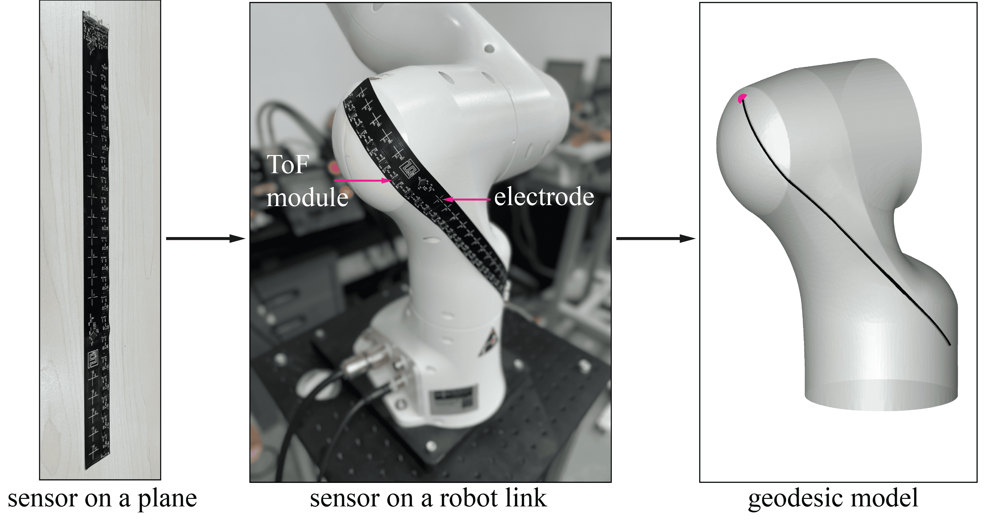

# Placement Optimization of Flexible Sensors for Human-Robot Collaboration
## Abstract
Flexible proximity sensors mounted on robot arms boost obstacle detection in human-robot collaboration (HRC). However, most of the flexible sensor placements lack further analysis to exploit the flexibility, leading to an inefficient and overpriced sensing system. 

In this work, we propose a systematic method to optimize the placement of the flexible proximity sensor for HRC. To prepare for the optimization, the geometric model of a flexible sensor is built.

An evaluation metric for the detection ability is established. 

Based on a global search algorithm, we obtain the optimized sensor placement with a sufficient detection ability and a minimum number of sensors. 

An experiment was conducted to verify the reliability of the method. 

The comparison between the optimized placement results and the conventional ones indicates that the proposed method could achieve better detection performance with much fewer sensors. This method also takes the flexibility into account by customizing the placement for different tasks. 

Emphasizing the merits of flexibility, this paper provides new insights into the application and the design of the flexible sensor for HRC. 
